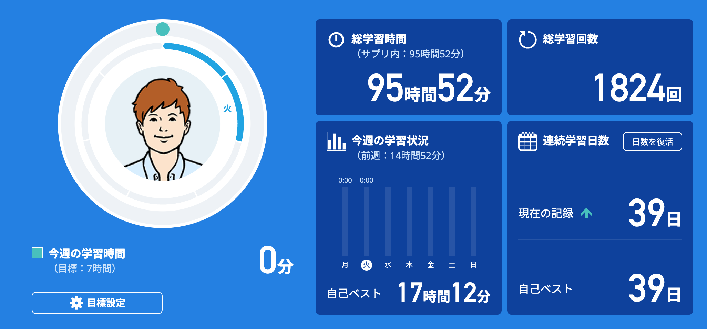
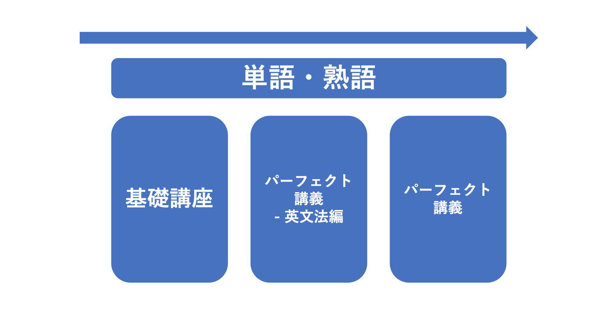
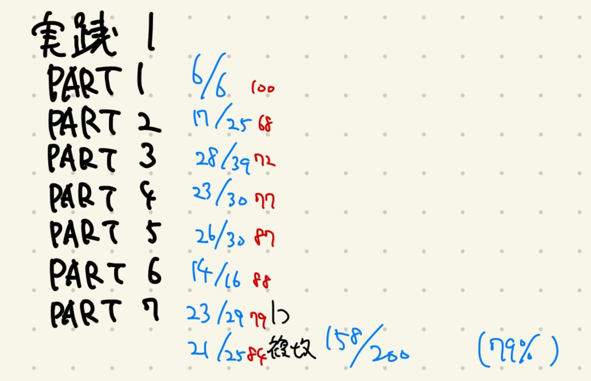
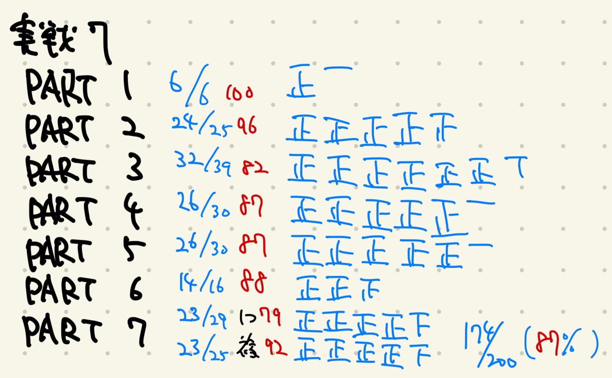
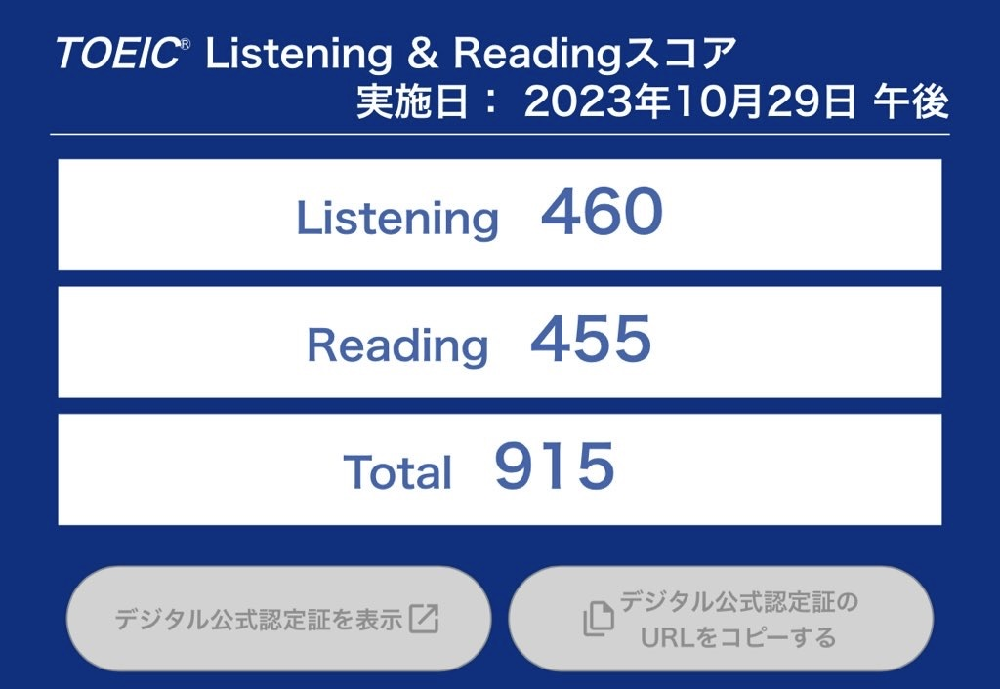

# はじめに

データサイエンティストを目指して日々勉強している、慶應大学理工学部4年生（2023.11.14時点）

取得資格、コンペ優勝経験など、リアルタイムの情報は👇👇👇をみてね

X: [@A7_data](https://twitter.com/A7_data)←こういう者です。
プロフィールページ→[こちら](https://mohki7.notion.site/Mototsugu-Oki-c478f842c4de48f394e2e24b58e206bb?pvs=4)

※全て、個人の意見です。個人差もあります。

# TOEICとは

　TOEICは、Test of English for International Communicationの略で、非英語圏の人々がビジネスシーンで英語を使う能力を測るためのテスト。

　リスニングとリーディングの2つのセクションで構成されており、それぞれ495点満点、合計990点が最高得点。

　TOEICスコアは、企業の採用や昇進、学校の卒業要件など、多くの場面で英語力の指標として利用されている。

https://www.iibc-global.org/toeic.html

# TOEICを受けた理由

　僕が目指している外資系企業も、TOEICの分布を見ると800以上しかいないとかのレベルで、僕は受けたことがなかったから（800以上取らないとまずいな）って思い、就活のために受験した。

　けど、どうせやるなら中途半端に終わりたくないからキリよく900以上を目指した。スコア900以上を取っている人は、全受験生のうちの約4%。

　英語の先生とか、帰国子女とか、YouTubeでよく見るTOEICガチ勢とかも含めて4%。ここに入れたらすごくない？？？って思って目指しちゃった。

https://www.iibc-global.org/toeic/official_data/lr/data_avelist.html

　ちなみに、YouTubeで「理系大学生×TOEIC 900の価値」っていう動画見て、「え、これマジで取ったら俺、ChatGPTコンペも優勝して統計検定準1級も取って、データサイエンス、AI勉強して、めっちゃすごくね？」ってニヤニヤしてた。

https://youtu.be/k9cpszA6J_A?si=glYonaIvffz5TWKk

https://youtu.be/J-d0o78X6mM?si=aSKFMgkUYzO_jBg1

理系大学生の皆さんはここら辺でモチベ高めてね

# 勉強開始時の英語レベル

TOEIC 900を1ヶ月で超えたって言ってるけど、「どうせ元々レベル高かったから1ヶ月でできたんでしょ」って思ったそこのあなた、違います。

**英語は苦手って自覚してた**。

## 中学3年で英検2級落ちた

落ちました。なんか勘違いして受かったと思ってたけど落ちてた。

中学生で英検2級取ってたらまあちょっとすごいぐらいだと思うけど、落ちてます。

<<<<<<< HEAD
そのあとは高校に進学して、なぜか上級クラスに配属され、3年間ネイティブの人
=======
そのあとは高校に進学してなぜか上級クラスに配属され、3年間ネイティブレベルの先生の授業を受けた。英語でビートルズのこと習ったり、AIの思考実験の難しい議論したり、向こうの小説数冊読んだり、経済学を英語でやったり。

もちろん、3年間何言ってるかわからないまま終わったし、期末テストは毎回平均-20〜10の間を右往左往してたし、英文法は一切習わなかった。

そんな感じで大学へ。
>>>>>>> toeic

## TOEICスコア診断テスト

大学に来てからは1, 2年生で英語の授業があっただけで、そこからほぼノータッチ。

ぼちぼち、（就活で忙しくなる前にTOEIC取っておかないとなあ〜）って思ってて、気づいたら大学4年の9月になってた。（院進するから就活はM1の春から）

つまり、**英文法は中学レベルでストップしてた**。「前置詞って何？」「Whenの中って、なんか現在形にするんだっけ？」「仮定法って、とりあえずifの後過去形にするんよね」とかのレベル。

https://santa.alc.co.jp/

流石にまずい、と思って、まずはTOEICスコア診断テストを受けてみた。

結果は、Reading 400、Listening 290で合計690点レベルって言われた。

（え、意外に高くね？///）なんてなぜか自惚れた笑

まあ、何も対策なしでReading 400は割とすごいと思うけど、正直雰囲気で回答してまぐれ当たりが多かったから、実力は多分もっと下だった。

そんな感じでTOEICの勉強を開始した。

# 総勉強時間・流れ

結論から言うと、スタサプどっぷりやって、空き時間でYouTubeと文法特急やって、最後3日くらいで公式問題集やった、って感じ。

これはTOEIC受験日にスクショしたスタサプの画面。

総学習時間はスタサプ96時間くらいで、その他も合わせると多分120時間くらい。

それを39日で回したから、一日当たりに直せば3時間くらい。

つまり、英語が苦手な人でもTOEIC 900 は「**1ヶ月ちょい、1日3時間やれば達成可能**」と言えるはず。

※個人差はあります。

- 1日3時間で1ヶ月ちょいやれば900は超える
- 基礎からやりたい人はスタサプがおすすめ
- スタサプ、公式問題集、文法特急は購入必須。これさえあれば戦える
- 隙間時間で単語、シャドーイングをひたすら。

# 使用教材

使った教材は以下の5種類。上から役に立った順で並べている。

Twitterとか、Xとか、色々なところで色々な本がおすすめされるけど、僕はみんなが共通して薦めているものだけでスコア900を達成できた。

特に特急シリーズは色々派生形があるけど、900超えるくらいなら文法特急と金フレだけで十分だと思う。

## スタサプ

まずは使う教材何にしようかな？ってググったら色々出てきたけど、基礎からやり直せるスタサプがちょうどいいなって思った。

https://eigosapuri.jp/

よくCMで見る関先生の文法講座と、豊富なリスニング対策講座、TOEICに必要な単語1500＋英熟語530、20回分の実践問題集など、全て準備されててあとは走るだけって感じの素晴らしい教材だった。

[https://youtu.be/erIvwHba-Jg](https://youtu.be/erIvwHba-Jg)

関先生を理系で例えるならヨビノリ。「一家に1人ヨビノリ」っていうのは理系大学生の共通認識だと思うけど、その英語バージョンだと思ってもらえるとスタサプの魅力が伝わると思う。

TOEIC本番のノウハウもちょくちょく教えてくれて、それもすごく役だった。関先生、ありがとうございました。

https://youtu.be/NMchc3Rrhz4?si=L_ptY5T_Z-QC0POs

僕よりエグい人もいた。笑

ちなみにベーシックコースとパーソナルコーチプランがあるけど、僕はベーシックで十分だった。テキストも買ってない。というより、1ヶ月ちょいでやるならベーシックをやり切るだけでも精一杯な感じ。

料金は月額3278円。**あれこれたくさん本を買うよりスタサプに申し込んで1ヶ月ちょいで集中して終わらせる方が断然お得**。

## 公式問題集

**これは必須の教材**。TOEICは問題の持ち出しが禁止だから、過去問は公式が出しているものが一番信頼できるし、本番に近い。

本屋に行ったらたっくさん置いてあるけど、新しいものを選んだ方が良いらしい。

僕がやったのは[公式問題集の7](https://amzn.to/3sCGJMv)。8とか9とかもあったけど、数字の7が大好きだから7にした。こういう願掛けみたいなのも大事だよね。

https://amzn.to/3sCGJMv

理系学生らしくないって思われるかもしれないけど、人生大事なのは「**ロジックとパッション**」だと思ってるから。

今はAmazonで[公式問題集の10](https://amzn.to/3u8igPp)も売ってる。新しいものを買うならこれがいいと思う。

https://amzn.to/3u8igPp

**価格はどれも3300円。これは必須経費。TOEICは時間が足りないから時間配分がめちゃくちゃ重要**なんだけど、これをやって初めて感覚を掴めた。

スタサプの実践問題集は全体的に優しめだから、最後10分余りとかになっちゃってて、本番の感覚が掴みづらい。これがおすすめ。

ちなみに、公式問題集1冊に2回分の過去問が入ってる。全ての本のそれぞれの回の本番に比べての難易度は以下のサイトにまとまってる。

https://toeic-teacher.com/official-mondaisyu-level/

まあ、正直どれ買ってもいいとは思う。

## 文法特急

TOEICで求められるスキルは「**素早く、正確に解く**」こと。本当に時間が足りないから、PART 5の文法問題はできるだけ瞬殺する必要がある。

そのためにはいちいち文章を和訳してたら間に合わないわけで、**文の型から解くことが必須**。

例えば、a (     ) girl だったら、冠詞が来て、後に名詞が来てるから、(  )の中には形容詞が入る、→選択肢の中で形容詞はこの単語。

みたいに。もちろん、こんな綺麗に解ける問題だけではないけど、全文を読んで意味を考えて解く、なんて全ての問題でやってたら時間は足りない。

**この「文の型から解くスキル」を身につけられるのがこの一冊。**

https://amzn.to/49Dg3vz

「そんなの英語のスキル上がってるうちに入らない！資格のための勉強だ！」って思った方、これはTOEICからのメッセージです。英語をできるようになるには、品詞は大事だよってことです。これも関先生が言ってました。関先生が言うんだから間違い無いです。

「前置詞って何？」「品詞とか覚えてもアメリカ人はそんなこといちいち気にしてないはずだからいらないしょ」って思って何もしてこなかったレベルの自分でも、これとスタサプの文法講座で型で解くスキルは身につけられた。超おすすめ。

僕はこれを試験前までに3周した。979円で安いのも**コスパがめちゃくちゃいい。**

## YouTube

YouTubeにもTOEIC系の動画は溢れてる。僕はリスニングがすっごく苦手だったから、移動時間はイヤホンをしてリスニングの対策してた。

詳しいリスニング対策方法は後ほど。

これとか使ってた。

https://youtu.be/iBgV0a8or14?si=GULtZDmD6kdk82mD

他にもたくさんあるけど、検索して出てきたものを適当に使ってた。

YouTubeは無料だし、いい教材たくさんあるからありがたい。

## 金フレ

さて、おそらく最も有名な金フレがこの順位ですが、これはスタサプで十分だったからというのと、やる時間がなかったって言うのが大きい理由。

スタサプにない単語も多々乗ってるから、これも完璧にしておけばもっとスコア高かったかもしれない。。。

https://amzn.to/3MLJxh3

結局間に合わなくて730点レベルまでしかできなかった。スタサプやらないなら、これは必須だと思う。

979円でベストセラー。

# 具体的な勉強方法

さて、以上の教材を使用してやったことをまとめる。

- とにかく全体像を掴むため文法は爆速で進める。単語も並行してずーっとやる
- 単語の暗記は質より量。とにかく回す。
- 単語は聞いて意味がわかるようにする。
- リスニングはひたすらディクテーションとシャドーイング。これだけで十分。

## Reading

Readingのポイントは「型で解く力」「スピード」「正確性」の三つ。

### 文法

文法を知らずには何も始まらない。上記の通り、僕は基礎文法も怪しかったからスタサプの基礎講座からやり直した。

イメージはこんな感じで、単語と熟語はずっとやる。その他のスタサプの講座を順に終わらせて行った。

ミスがあってもとりあえず進むのが大事。素早く全体像を把握して、苦手なところを重点的に対策するっていう流れでいった。

スピード感としては、1ヶ月で全てをやる必要があったから、1日300単語、かつ講座も10-20個やってた。

「1日300単語覚えるなんて無理だろ！」って思ったかた、次もちゃんと読んでね。

受験日から逆算して、1日どれくらいやる必要があるか計算したら、このくらいやらないと間に合わなかった。

### 単語

「単語は1日10個ずつ完璧に覚えてコツコツ」というやり方の方、今すぐやめてください。永遠にTOEIC 900は取れません。

「**単語は1回1回確実に覚えるのではなく、素早く何周もする**」これが短時間で多くの単語を覚え、なおかつ記憶に定着させるコツです。

1日10個ずつ完璧に覚えてコツコツやっても、5日後には1日目にやった単語はほぼ忘れてます。人間の脳はそうできてないです。

人間の脳は「何度も見るものは記憶に残る」という性質があります。英単語も一緒。1回1回の暗記の質を高めるのではなく、量を高めます。質より量です。

1周目は知ってる単語と知らない単語の分類、くらいの感覚でバンバン進みます。2周目からは少しずつ覚える意識で、声に出して、頭の中で想像していきます。ただ、覚えなくていいです。まあなんとなくイメージできたなってくらいでどんどん進みます。

これで6周くらいすれば、もう98%は覚えてます。残りの2%は厄介なので、そこだけ紙にまとめて重点的に覚えます。

これで単語は完璧。

あ、あと、「単語は見ずに聞いて意味がわかるようにする」もポイント。僕は「聞いてもわからないけど、見ればわかる単語」が大量にあった。

つまりこれは単語を目で覚えているということ。それだとリスニングで使えない。僕がリスニング弱い理由の一つはこれだった。

スタサプではスペルを隠して音声だけで単語を覚える機能もあるから、それしか使ってなかった。英単語を見ればわかる、なんて状態は意味がないから聞いてわかる状態に持っていった。

あ、あと、覚えた英単語は日常で呟くのも大事。例えば、implement(実行する)を覚えたら、何か動作をするときに「implement!」って言いながらやる。そして実行するには類義語がたくさんあるから、思いつく限り呟く。enact, enforce, carry out, execute, conduct,,, こうやってぶつぶつ言いながら家では生活してた。

できれば文章が作れれば最高だけど、短期間ではそううまくはいかない。でも、赤ちゃんが頑張って何か文にならないようなことを頑張っていうように、思いつく単語を紡ぐだけでもいいからただただそれを繰り返すと、早く単語が身についた。

なんならやり始めて3日目くらいで、英語脳が育ち始めてるような感覚になれた。もう勝手に英単語が出てきかけてるみたいな。アメリカ人の赤ちゃんの脳が自分の中で成長し始めている、みたいな感覚。不思議だけど、そうなるのよ。笑

## Listening

リスニング、苦手だったんだけど、結局ディクテーションとシャドーイングをやりまくるだけだった。

スタサプはどっちもやりやすいような機能がついてて、各講義の後に両方やることができて、すごくリスニングが伸びた。

ディクテーションは、聞いた英文を一文字違わず書きとること、

シャドーイングは、英語の音声のすぐ後を追いかけるように話すこと。

シャドーイングは声を出さなくてもいいから、外出先でもできる。リスニング対策で一番効いたのはシャドーイングだった。

## 本番前の模試の出来具合

さて、ひたすら上で書いたことを繰り返して39日、本番1週間前くらいに初めてスタサプの実践問題集で200問ぶっ通しで解いた。

正答率はイマイチだったけど、もうこの時点で800点後半くらいはいくなって感じだったから、自信にもなった。

**大事なのは、自分がどのパートが苦手なのかをはっきりさせ、そこを重点的に治すこと。**

僕の場合はPART 2, 3, 4が苦手だったから、やっぱりリスニングを重点的にやった。ひたすらシャドーイング。

その4日後に解いた実践問題集7の結果。7が好きだから1の次に7を解いた。

リスニングを重点的に対策したおかげで、だいぶ点数が上がったことがわかると思う。一番苦手だったPART 2は96％まで上がった。PART 2のコツは流れてくる英文をシャドーイングすることだって自分で気づいたから、それを実践したらすごくできるようになった。

全てはシャドーイングです。

それから2日後、つまり本番3日前に初めて公式問題集を解いた。

診断スコアは805-935で、リスニングの正答率は90%、もうこの頃は「え？俺もしかしてほんとに900いけちゃう？？？」ってなってテンション上がってた。笑

けど、まだPART 3, 4が不安定だったのと、リーディングを含め不安は細かい文法事項と単語だったから、最後の最後までシャドーイングと英単語をやってた。あと覚えるべき文法事項を紙にまとめて、重点的に覚えた。

そしてその翌日、本番2日前に公式問題集のもう一つの過去問を解いた。

合計点はほぼ同じだったけど、一番苦手だったPART 2で満点取れたから、めちゃくちゃ嬉しかった。もはやここまでくるとリスニングの方が得意ってレベルになってた。そう。全てはシャドーイングです。

まあ、予想スコアも810-935で、ワンチャン900取れるなってレベルで本番に挑んだ。会場までの道のりもずっと聞き流ししてた。

「**まあ、ワンチャン900取れるって感じだけど、しっかり本番で900点代勝ち獲ってこそ男だからな。**」なんて思いながら試験受けた。

## 試験本番

初めてTOEIC受けて驚いたのは、周りのマークする音とか、ページめくる音とかがすごく聞こえること。

リスニングで隣の人がシャッシャッってマークする音が聞こえる。

（え？今マークするの？まだわからなくね？）とか、

リーディングはパラって後ろの人がページを捲る音が聞こえて

（え？めっちゃ早くね？ちょちょ、俺まだ全然だって、やば、急がなきゃ。）

とかいう余計な揺らぎが生まれる。これは本番受けないとわからない。

けど、それに負けないくらい、というか、（こんだけやったんだから、あとは自分のやったことを全て出すだけ）っていうメンタルでいけば、大丈夫。

「**大丈夫。俺ならできる。だって俺だもん。**」←これが僕の合言葉。

受験日から17日でネットで点数が見られる。

ドキドキしてみたけど、無事900超えてた。

ひとり部屋でガッツポーズした。本気で1ヶ月ちょい頑張って、色々な人に言ってプレッシャーかけて、フォロワー5500人超えてるアカウントでも発信して、それを有言実行できて、めちゃくちゃ嬉しかった。ここ最近で一番嬉しかった。

よくがんばりました、自分。

# 同時並行して卒論7割終わらせた

さてさて、ここで記事が終わってしまったらただの「TOEICを短期間で終わらせたそこらへんの人」になってしまう。

実はTOEICと並行して大学の授業も長期インターンも、そして卒論も同時並行して進めてた。まあそれが1日3時間くらいしかTOEICに時間を割けなかった理由だけど。

「なんでこんなにタスクをこなせるの？」ってよく聞かれるけど、詳しいことはまた後日の記事で。

とりあえず卒論に絞って今回は話す。

## 卒論

卒論は「MLBの2023年のルール改正ピッチクロックが、観客動員者数に影響を与えたかを統計的因果推論で検証する」をやっている。

手法は中断時系列分析というものを使ってる。

ただ、この手法を最初から知っていたわけではないし、なんなら因果推論すらよくわかってない状態だった。

そこから、AIツールを駆使することで、TOEICと並行して爆速で進めることができた。

2023年は生成AIが登場したけど、本当にこれを使いこなせるかどうかで、生産性がマジで変わる。

「いまだにChatGPTを触ったことがない」なんて人は論外。あっという間に社会に取り残され、すごい勢いで落ちていくだろう。

そのくらい、すごいものが現代は学生でも気軽に使えるくらいになっている。まだ触れたことがない人は、置いていかれたくなければ、この記事を読み終えたらすぐに触るべし。使い方がわからないって方は、解説記事も僕書いてます。ぜひ参考にしてください😌

## AIツールを駆使しろ！

諸々タスクを並行しつつ、卒論を7割終わらせながらTOEIC 915を1ヶ月ちょいで達成する、なんてAIがなければできてなかったであろうこと。

しかも僕だからできるわけではない。どんな人でもAIを使いこなせば何倍もの力を出せる。

孫悟空しか使えなかった界王拳が、全世界の人に解放されたようなもの。

## AIツールの活かし方

AI初心者の人におすすめなのはここら辺。というか、僕もこれらしか使ってない。

### ChatGPT

説明不要の2023年の主役。無料でも使えるけど、正直課金しないと話にならない。

「AIすごいすごいっていうけど、いうてじゃね？」って思う人は、おそらく有料版を知らないのでしょう。

有料版と無料版は雲泥の差。

https://openai.com/blog/chatgpt

月額20ドルだから、月3000円だけど、安すぎて僕はいまだにビビってる。ChatGPTの有料版を使いまくる僕にしてみれば、3000円分の時間やらお金やら精神的幸福は1日で生み出せる。余裕で。

研究室の先輩にも勧めたけど、「マジでもっと早く使っておけばよかった。凄すぎる。」って絶賛してた。

ほんとに試してほしい。大学生でも2, 3時間働けば賄える。TOEICのことも聴き放題。実際の使い方をいくつか示す。

- GPTsで自分の卒論資料を読み込ませ、担当教授-GPTを作成

  - 最近追加された機能だけど、任意のファイルをGPTに読み込ませると、それを学習した上で応答してくれるようになるもの。
  - 僕は今までの卒論中間発表資料を全て読み込ませ、壁打ち、現状の問題点、プログラム作成、など、諸々指示を出している。
  - 正直0から作らせて満足いくレベルのものは出てこないから、自分で作ったものを壁打ちして強くするのが一番良い使い方だと思う。
- 授業でわからないことを質問しまくる

  - 正直、配られた授業資料を教授が読むだけの授業を聞くより、授業の内容をChatGPTとやりとりして身につける方が何倍もいい。
  - ChatGPTと話すには自分の考えを文章にしなければいけないから、言語化能力も鍛えられる。これがめちゃくちゃ理解に役立つ。
  - 「これはこういう構造で、こういう弱点があって、って理解しているのですが、あっていますか？」と質問すれば、間違っているところを指摘してくれる。
  - 授業は聞いて内容を覚えるなんて効率が悪すぎる。インタラクティブに言語化を繰り返し、ChatGPTと会話して理解するものになりつつある。
- コード作成

  - プログラミングをする人はこれも大きい。自分がある程度書いたコードを渡し、「こういう機能を追加して」と言えば書いてくれる。
  - バグが出たらコピペして聞けば、解決法を教えてくれる。
  - リファクタリングだって完璧。すぐにめちゃくちゃ綺麗なコードが返ってくる。
  - 自分が知らない単元のものを実装する時にめちゃくちゃ重宝してる。

僕も自分の卒論テーマをどうすれば実現できるのかわからなかったから、「こういうことをやりたいんだけど、どんな統計的手法を使えばいい？いくつか手法を羅列して」って伝え、そこで出会ったのが中断時系列分析。

（お、使えそう）って思ったからググって詳しく調べて、使えるってわかったのでそこを深めていった。ここまでかかった時間はわずか30分足らず。

もしChatGPTがなかったら、もっともっと時間がかかっていただろうし、下手したら教授に相談しないとわからなかったかもしれない。

ChatGPTのインパクトが少しでも伝わっただろうか。

もう一つだけ重要なことを付け足すと、「ChatGPTによって、結果を一番最初に出せるようになった」ということ。

例えば、中断時系列分析で状態空間モデルを適用したいとする。その時、従来であれば状態空間モデルを勉強して、実装して、っていう大変なプロセスだったのが、ChatGPTに実装してって伝えれば結果が最初に出てしまう。その手法がどのような結果をもたらし、他の手法に比べてどのような利点があり、欠点があるのか、はたまたそれを研究のために勉強する必要があるのか、が最初にわかってしまう。

これは余計な回り道が一切なくなる、画期的なものだと思う。これで超大幅に時短している。

本当に、ChatGPTの有料版を使ってほしい。テクノロジーの進化の喜びを分かち合いたい。

### Claude 2

ChatGPTほどの知名度はないけど、ChatGPTの有料版に引けを取らないくらいの性能のAIを無料で使えるサービス。

https://claude.ai/chats

ChatGPTとの最大の違いは、pdfファイルの読み込み精度と安定性。

論文を読むとき、pdf資料を読むとき、共有して問題のないものであれば、僕はとりあえずClaudeに渡して要約させ、質疑応答もできる。

これで論文を読むスピードも爆上がりした。超おすすめ。

使い方もめちゃくちゃ簡単。ChatGPTの有料版にまだ抵抗がある人は、まずはこっちを使うのもあり。

ただ、ChatGPTの有料版はClaudeよりもすごい。と感じる。

### GitHub Copilot

これはプログラミングをする人には超おすすめ。まあ、エンジニアであればもはや全員知ってるだろうから、詳しい説明はしない。

まだ使ってない人は使ってほしい。AIサジェスト機能でめちゃくちゃプログラミングが楽にできる。

コードを書く労力と時間が大幅削減される。もう僕はないとコーディングできない。そのくらいすごい。

https://qiita.com/SNQ-2001/items/796dc5e794ac3f57a945

学生は無料で使えるから、以下のサイトを参考に試してみてね。一般の方も月10ドルで使えちゃうから、全然ペイ。

1500円分なんて、すぐに回収できる。

# 終わりに

ごめんなさい、めちゃくちゃ長くなりました。読んでくださり、ありがとうございます。

## やればできる。

ここまで読んだ方は「いやいや、無理だろ。笑」って思った方もいるかもしれない。

確かに、今すぐにできるようになれるとは言わない。けど、すぐにできるようになる。やろうとすることが大事で、ここでやろうとしなければ、一生あなたはできない。

しかも僕なんて比べ物にならないくらい高レベルのことをマルチタスクで進めている人なんて山ほどいる。僕も「あのレベルは無理だ。」って思ってるけど、諦めてはない。今は無理だけど、いつの日かできるようになるために、少しずつ日々努力を続けている。そうすれば、気づけば周りとは格段に成長している。その過程は何にも変え難いほど楽しい。

決してTOEICだけに集中して1ヶ月対策したのではない。しかも1日3時間くらいしかやってない。

つまり、誰にでもできるはずである。

大丈夫。あなたならできる。だってあなただもん。

## Xフォローしてね

今回は記事にまとめたけど、Xでは日頃から最新のAI・データサイエンス系の情報を発信しつつ、勉強記録も呟いている。

もっとリアルな情報を知りたい、頑張ってる人に刺激を受けたいという方はぜひ、覗いてみてください😌

X: [@A7_data](https://twitter.com/A7_data) 連絡をくだされば、いつでも対応させていただきます。

共に、日々1歩でも成長していきましょう🔥
