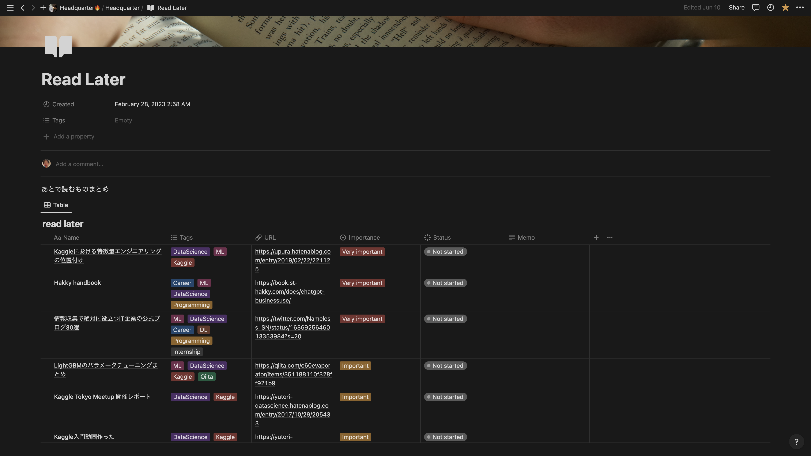
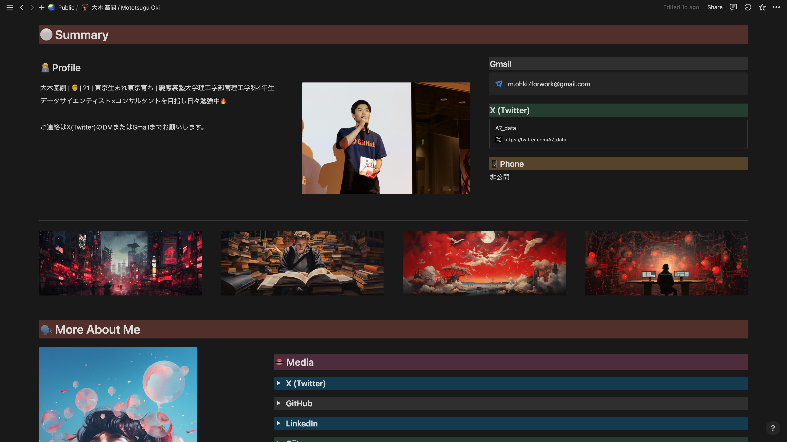

# 自己紹介

X: [@A7_data](https://twitter.com/A7_data)←こういう者です。プロフィールページ→[こちら](https://mohki7.notion.site/Mototsugu-Oki-c478f842c4de48f394e2e24b58e206bb?pvs=4)

[https://twitter.com/A7_data](%E2%80%B8https://twitter.com/A7_data)

[https://mohki7.notion.site/Mototsugu-Oki-c478f842c4de48f394e2e24b58e206bb?pvs=4](https://mohki7.notion.site/Mototsugu-Oki-c478f842c4de48f394e2e24b58e206bb?pvs=4)

# 概要

Notionというサービスを使って、ポートフォリオサイトを**無料**で、**ノーコード**で作成する方法を解説します。

とっても簡単なので誰でもできます👍

また、少しおしゃれに見せるコツも解説しているので、最後まで読んでみてください😌

# Notionとは

## 無料で使える超多機能メモ帳

Notionは無料で使える、**超多機能メモ帳。**

https://www.notion.so/

具体的に何ができるかというと、

メモ、タスク管理、ドキュメント管理、データベース、複数人での共同作業、プロジェクト管理、家計簿、Notion AIによる文章生成、、、

できることが多すぎて正直書きれないです。

個人的には、全てをNotionで管理しているのでもうNotionがなければ生きていけないレベルです。

たっくさんのページがあるのですが、そのうちいくつか紹介すると、

↑ほしい物リストページ

↑後で読みたいものまとめページ

↑僕のプロフィールページ（今回の記事で作り方を解説します）

[https://mohki7.notion.site/Mototsugu-Oki-c478f842c4de48f394e2e24b58e206bb?pvs=4](https://mohki7.notion.site/Mototsugu-Oki-c478f842c4de48f394e2e24b58e206bb?pvs=4)

これらのように、自分だけの超便利ページを自由に作ることができます！

## 学生ならplus planが無料に

# ポートフォリオサイトの作成（基本）

僕がNotionで作ったポートフォリオサイトはこんな感じ。

[https://mohki7.notion.site/Mototsugu-Oki-c478f842c4de48f394e2e24b58e206bb?pvs=4](https://mohki7.notion.site/Mototsugu-Oki-c478f842c4de48f394e2e24b58e206bb?pvs=4)

## ページを作ってみる

ページを作ろう

## リンクをカード形式で挿入する

リンクを文字形式ではなく、カード形式で挿入することによっておしゃれさが上がります。

## ページを公開する

公開しよう。サーバーなどは必要なく、ちょちょっといじるだけ。無料です。

ページを更新すれば自動的にページも更新されます。

# ポートフォリオサイトの作成（応用）

## ページに写真を追加する

## ポイントは列の使い方

## レイアウトに工夫を

僕はデザインのプロではないので、詳しいことはわからないが、横長の画像だけでなく縦長の画像を使うとよりカッコよく見えると思う。

## 補足情報はトグルか新たなページを使おう

# 終わりに

Notionはとても便利な超多機能メモ帳。今回はプロフィールページを公開しましたが、普通に自分のブログサイトとして使うこともできます。

Notionにもっと詳しい人はもっともっと賢い使い方をしています。思わず「すご・・・」と言ってしまいたくなるようなページもたくさん。。。

そういう方はテンプレートを公開してくれている場合も多いので、ググってみてください👍

普段はデータサイエンティストを目指す大学生として、[X (@A7_data)](https://twitter.com/A7_data)でAIやDSの最新情報・勉強記録を発信しています！

フォロワーはありがたいことに5000人を超えました！これからも頑張ります🔥

記事にするよりも早く、そしてどんどんツイートするので、気になった方はぜひ。
